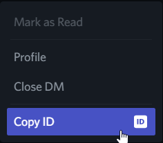

<h1 align="center">
  <br>
  <a href="https://github.com/staciax/ValorantStoreChecker-discord-bot"></a>
  <br>
  Valorant Discord Bot
  <br>
</h1>

<h4 align="center">Store, Nightmarket, Battlepass, Missions, Bundle, Notify</h4>

<p align="center">
  <a href="https://discord.gg/RaCzsPnfNM">
      
    </a>
  <a href="https://github.com/staciax/ValorantStoreChecker-discord-bot">
     
  </a>
  <a href="https://github.com/Rapptz/discord.py/">
     
  </a>
    <a title="Crowdin" target="_blank" href="https://crowdin.com/project/discord-bot-valorant">
 </a>
 <a href="https://github.com/staciax/ValorantStoreChecker-discord-bot/blob/master/LICENSE">
     

</p>

<p align="center">
  <a href="#about">About</a>
  •
  <a href="#installation">Installation</a>
  •
  <a href="#screenshots">Screenshots</a>
  •
  <a href="#usage">Usage</a>
  •
  <a href="#translations">Translations</a>
  •
  <a href="#disclaimer">Disclaimer</a>
  •
  <a href="#special-thanks">Special Thanks</a>
  •
  <a href="#support-me">Support</a>
</p>

<!-- Inspired by Red Discord Bot -->
<!-- https://github.com/Cog-Creators/Red-DiscordBot -->

## Note ⚠️
- will not receive updates until v4.0.0 will be finished. sorry 😭
- `
I'm a student and I have to divide my study time with this project.`

# About

Discord bot that shows your information and more without opening VALORANT by using
the [In-game API.][ValorantClientAPI]
written using Python and the [Discord.py][DiscordPy] library <br>
If you need help regarding Valorant Discord Bot, please join the [support server][Support]

## Heroku
- [ ⚠️ Heroku announces plans to eliminate free plans][Heroku_announce]
> Important: Please note that dynos will have be restarted every **24 hours**. All changes to the local filesystem will be deleted, which means you'll have to relogin using `/login` once the 24-hour limit is reached. Read more about automatic dyno restarts [here][Heroku].

[](https://heroku.com/deploy)
- [Youtube Tutorial][Tutorial]

## Repl.it

> Important: All projects under the Repl.it free plan are public. To solve the privacy problem, all data is stored in the Repl.it Database, but the Repl.it Database is slow to read and it takes time to execute commands. (Cache system to be updated)

[](https://replit.com/new/github/staciax/Valorant-DiscordBot)

P.S. need to add 2 secrets: `TOKEN` and `OWNER_ID`, need to use [Uptimerobot](https://uptimerobot.com/) or other services to keep the bot alive.
## Docker

To simply install the latest stable version, run

```
docker pull marchingon12/valorant-bot
```

If using Docker Desktop (GUI), run using environmental variables under "Optional Settings". Put in your TOKEN and OWNER_ID.

<p align="center">
  
</p>

If using Docker-CLI, you have to manually put in your env vars in a single line like this:

```
docker run -e TOKEN=<YOUR_BOT_TOKEN> -e OWNER_ID=<YOUR_OWNER_ID> marchingon12/valorant-bot
```

or use `--env-file` to point to the path you stored your env file. Read more info on how to do so [here](https://docs.docker.com/engine/reference/commandline/run/#set-environment-variables--e---env---env-file).

View on Docker image on [DockerHub](https://hub.docker.com/r/marchingon12/valorant-bot).


## Screenshots

* Embed Design by [Giorgio][Giorgio]


<details>
<summary>See more screenshots</summary>


</details>

## Installation

* [Python 3.8+](https://www.python.org/downloads/)

* Install requirements

* **Create** the [discord bot][DiscordBotDocs]

* Under **Privileged Gateway Intents** enable [`MESSAGE CONTENT INTENT`](/resources/dc_MESSAGE_CONTENT_INTENT.png)

* Enable the required bot [permissions](/resources/dc_BOT_PERMS.png).

* Invite your bot to the server with the scopes [`bot & applications.commands`](/resources/dc_SCOPES.png)

* Clone/[Download][ZipDownload]

```bash
pip install -r requirements.txt
```

```bash
# manual install package
pip discord.py
pip install requests
pip install python-dotenv
```

* Store discord bot token and owner ID under [.env](/.env)

```
TOKEN='INPUT DISCORD TOKEN HERE'
OWNER_ID='INPUT YOUR DISCORD ID'
```
*  <details><summary>How to get your Owner ID</summary>
    <p>

    1. Turn on Developer Mode under Discord Settings > Advanced 

    2. Right click on your profile icon in any chat and copy your ID 

    </p>
  </details>

* Run the bot

```bash
python bot.py
```

* the Slash Command (`/`) will automaticalled be assigned for global commands (global commands can also take up to an hour to update for Android users). Refer to [docs][CommandDocs].
* to use commands in your server immediately, use `-sync guild`.
* remove commands in your server by using `-unsync guild`.
* remove global commands by using `-unsync global`. This removes commands for everyone using the bot.

> Important: custom emojis used by the bot will be added to your server so that they can be accessed when needed. If there are no slots left, emojis will not be added and therefore displayed in text from e.g. `:ValorantPointIcon:`. There are 7 custom emojis in total.

## Usage

| Command                       | Action                                                                                                     |
| :---------------------------- | :--------------------------------------------------------------------------------------------------------- |
| `/store`  | Shows your daily store |
| `/point`  | Shows your valorant point |
| `/login`  | Log in with your Riot account |
| `/logout`  | Log out of your Riot account |
| `/misson`  | View your daily/weekly mission progress |
| `/nightmarket`  | Shows your nightmarket |
| `/battlepass`  | View your battlepass' current tier |
| `/bundle`  | inspect a specific bundle `credit by Giorgio` |
| `/bundles`  | Show the current featured bundles `credit by Giorgio` |
| `/cookies`  | Login to your account with a cookie, [How to cookies][SkinpeekCookies] `credit by Giorgio`, [video][CookieLogin] |
| `/notify add`  | Set a notification when a specific skin is available on your store |
| `/notify list`  | View skins you have set a notification for |
| `/notify mode`  | Change notification mode `Specified skin` or `all skin` |
| `/notify test`  | Testing notification |
| `/notify channel`  | Change notification channel `DM Message` or `Channel(in server)` |
| `/debug`  | command for debug `emoji`, `skin price`,`cache` is not loaded |

## Translations

If you want to use your language and would like help translate the bot, please do!

- Option 1

1. You can translate my crowdin project [here][Crowdin].

- Option 2 (inspiration by [giorgi-o][Giorgio])

1. [Fork the repo][ForkDocs]
2. Look up the language code for your language [here][Locales]
3. In the `languages` folder of your forked repo, copy `en-US.json` and rename it to your language code
4. Open that file and do the thing
5. Open a pull request

- Alternatively, you can just send me the JSON on discord and I'll upload it for you.

## License

This project is licensed under the GNUv3 License - see the [LICENSE](LICENSE.md) file for details.

## Disclaimer

Please read the [DISCLAIMER](DISCLAIMER.md) before using the code to host your bot.

```
Valorant-DiscordBot is not endorsed by Riot Games and does not reflect the views or opinions of Riot Games or anyone officially involved in producing or managing Riot Games properties. Riot Games and all associated properties are trademarks or registered trademarks of Riot Games, Inc.
```

## Special Thanks

This project wouldn't have happened without.

- [HeyM1ke/ValorantClientAPI][ValorantClientAPI]
  for providing a great API about Valorant!

- [colinhartigan/valclient.py][ValClientPy]
  for beautiful client endpoint

- [techchrism/valorant-api-docs][ValApiDocs]
  for API docs documentation

- [Valorant-API.com][ValApi]
  for every skin names and images!

- [github/giorgi-o][Giorgio]
  for always helping me and more!. ValoBot in JS [SkinPeek][Skinpeek]

- [Discord - Valorant App Developer ][VAD]
  developer community for valorant api

- [Contributors][Contributors] <3 <3

- Thank you very much <3

### Support Me

[](https://ko-fi.com/staciax)

<a href="https://tipme.in.th/renlyx">

</a>


<!------------------- Links -------------------->

<!-- Valorant -->
[ValApi]: https://valorant-api.com/

<!-- Discord -->
[Support]: https://discord.gg/RaCzsPnfNM
[DiscordBotDocs]: https://discord.com/developers/applications
[VAD]: https://discord.gg/a9yzrw3KAm
[Locales]: https://discord.com/developers/docs/reference#locales
[CommandDocs]: https://discord.com/developers/docs/interactions/application-commands

<!-- Github -->
[ZipDownload]: https://github.com/staciax/ValorantStoreChecker-discord-bot/archive/refs/heads/master.zip
[ForkDocs]: https://docs.github.com/en/get-started/quickstart/fork-a-repo
[ValorantClientAPI]: https://github.com/HeyM1ke/ValorantClientAPI
[ValClientPy]: https://github.com/colinhartigan/valclient.py
[ValApiDocs]: https://github.com/techchrism/valorant-api-docs/
[Giorgio]: https://github.com/giorgi-o
[DiscordPy]: https://github.com/Rapptz/discord.py
[Skinpeek]: https://github.com/giorgi-o/SkinPeek/
[SkinpeekCookies]: https://github.com/giorgi-o/SkinPeek/wiki/How-to-get-your-Riot-cookies
[Contributors]: https://github.com/staciax/ValorantStoreChecker-discord-bot/graphs/contributors

<!-- YouTube -->
[Tutorial]: https://youtu.be/5ZFsEcDT8e4
[CookieLogin]: https://youtu.be/cFMNHEHEp2A

<!-- Other -->
[Heroku]: https://devcenter.heroku.com/articles/dynos#automatic-dyno-restarts
[Crowdin]: (https://crowdin.com/project/discord-bot-valorant)
[Heroku_announce]: https://blog.heroku.com/next-chapter
